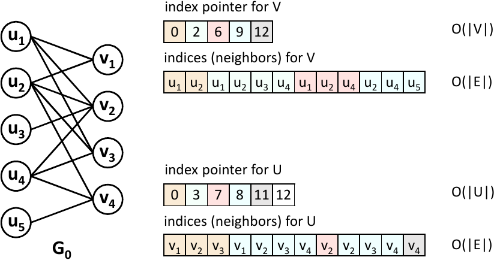
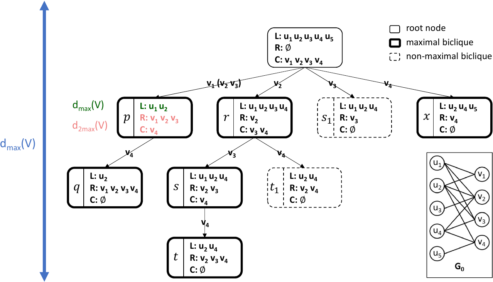
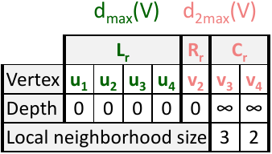

## Abstract

You can reproduce all experimental results (in Figure 6-13) with the scripts, which roughly match the figures from the paper. We provide scripts for Figure 6, Figure 8-11, and Figure 13. By default, scripts for Figure 6 and Figure 8-11 run on a machine with an NVIDIA A100 GPU. The script for Figure 13 runs on a machine with 8 NVIDIA V100 GPUs. Since Figure 7 is based on our empirical estimation of memory requirement,  we will detail it soon. Figure 12 shows the adaptability of GMBE on different GPUs. You may manually run GMBE on different GPUs and generate Figure 12 refer to the script for Figure 6.

## Generation for Figure 7

  

Fig. 1: Memory requirement for the input graph

According to Fig. 1, we know the input graph G0(U, V, E) in CSR format requires |U|+|V|+2×|E| memory so that we can access the neighbors of any vertex in U or V quickly.

  

Fig. 2: Memory requirement for each procedure in GMBE-W/O-REUSE

According to Fig.2, we know each procedure in GMBE-W/O-REUSE requires dmax(V) ×(dmax(V) + d2max(V)) according to Section 3.1 in our paper.

  

Fig. 3: Memory Requirement for each procedure in GMBE

According to Fig.3, we know each procedure in GMBE-W/O-REUSE requires 2×dmax(V) + 3×d2max(V) according to Section 4.2 in our paper. 

Considering that each SM in GPUs will run WarpPerSM procedures simultaneously, GMBE-W/O-REUSE requires |U|+|V|+2×|E| + dmax(V) ×(dmax(V) + d2max(V)) × WarpPerSM × NumberOfSMs in total and GMBE requires |U|+|V|+2×|E| + (2×dmax(V) + 3×d2max(V)) × WarpPerSM × NumberOfSMs in total. According to Section 6.1 and Table 1 in our paper, WarpPerSM is 16 and NumberOfSMs is 108 by default.

|  |  |  |  |  |  |  |  |  |
|:---:|:---:|:---:|:---:|:---:|:---:|:---:|:---:|:---:|
| **Datasets** | **Abbr.** | **\|U\|** | **\|V\|** | **\|E\|** | **dmax(V)** | **d2max(V)** | **GMBE-W/O_REUSE (GB)** | **GMBE (GB)** |
| MovieLens | Mti | 16528 | 7601 | 71154 | 146 | 3217 | 3.394443924 | 0.069391764 |
| Amazon | WA | 265934 | 264148 | 925873 | 546 | 903 | 5.47798376 | 0.035799824 |
| Teams | TM | 901130 | 34461 | 1366466 | 2671 | 2838 | 101.7215677 | 0.110446764 |
| ActorMovies | AM | 283640 | 127823 | 1470404 | 294 | 7798 | 16.45738886 | 0.179172668 |
| Wikipedia | WC | 18533493 | 182947 | 3795796 | 11593 | 4629 | 1299.987329 | 0.361480704 |
| YouTube | YG | 94238 | 30087 | 293360 | 7591 | 7356 | 784.2568676 | 0.26031618 |
| StackOverflow | SO | 545195 | 96680 | 1301942 | 6119 | 31636 | 1596.842888 | 0.753576188 |
| DBLP | Pa | 5624219 | 1953085 | 12282059 | 1386 | 2119 | 33.70657785 | 0.191665336 |
| IMDB | IM | 896302 | 303617 | 3782463 | 1334 | 15233 | 152.7928721 | 0.369372084 |
| EuAll | EE | 225409 | 74661 | 420046 | 7631 | 23844 | 1660.168292 | 0.604480776 |
| BookCrossing | BX | 340523 | 105278 | 1149739 | 13601 | 53915 | 6347.197703 | 1.31698278 |
| Github | GH | 120867 | 59519 | 400237 | 884 | 15994 | 103.1320141 | 0.34779544 |

Thus, we can generate Figure 7 in our paper using the statistics in the table above. 
